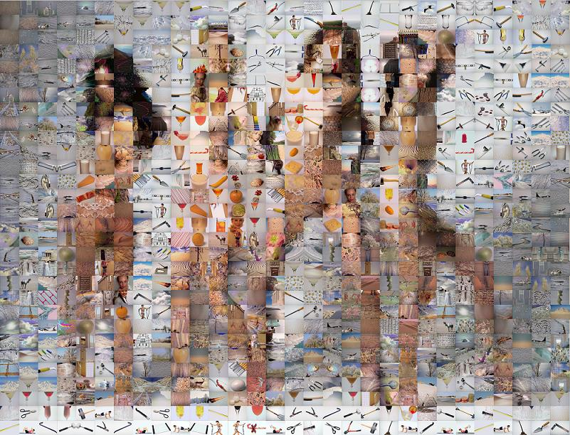



## Real PhotoMosaic  11

### Description

Create PHOTOMOSAICS (see screenshot) 

----

Create picture formed from 100's of smaller pictures. 

----

Feautres: ---*Manage Mirrored tiles* ---*Manage Duplcated Tiles and Minimal Distance between them* ---*Tile Masks* ---*Rotated Tiles* ---*Blend with Source pic* ---* 10 PhotoMosaic Styles*. 

----

This Version Main New: Rotated Tiles
 
### More Info
 

             |
---                |---
**Submitted On**   |2009-09-22 00:53:58
**By**             |[reexre](https://github.com/Planet-Source-Code/PSCIndex/blob/master/ByAuthor/reexre.md)
**Level**          |Advanced
**User Rating**    |5.0 (30 globes from 6 users)
**Compatibility**  |VB 6\.0
**Category**       |[Complete Applications](https://github.com/Planet-Source-Code/PSCIndex/blob/master/ByCategory/complete-applications__1-27.md)
**World**          |[Visual Basic](https://github.com/Planet-Source-Code/PSCIndex/blob/master/ByWorld/visual-basic.md)
**Archive File**   |[Real\_Photo2163309242009\.zip](https://github.com/Planet-Source-Code/reexre-real-photomosaic-11__1-72053/archive/master.zip)

